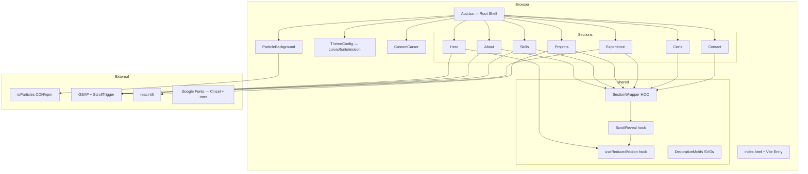
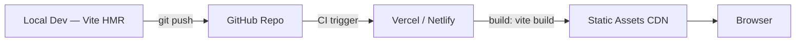
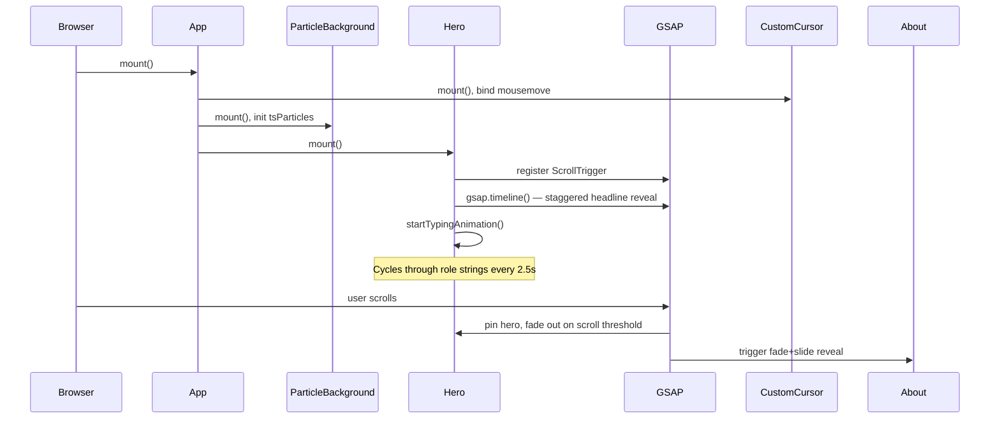
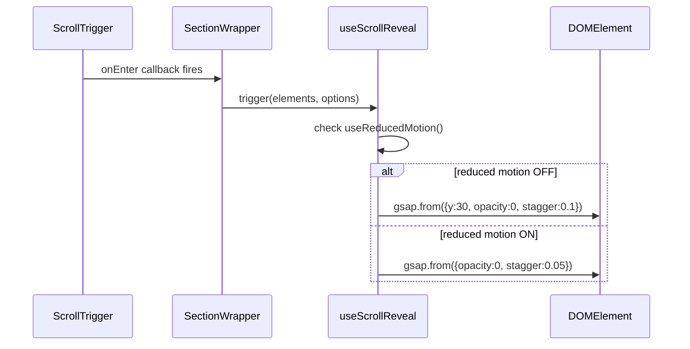
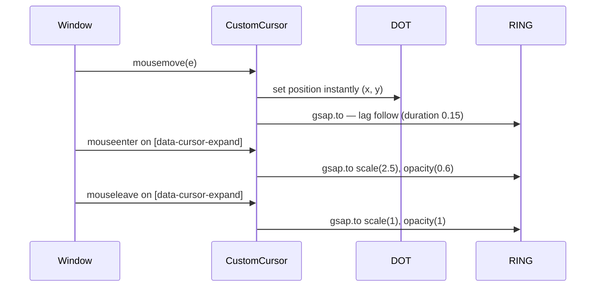
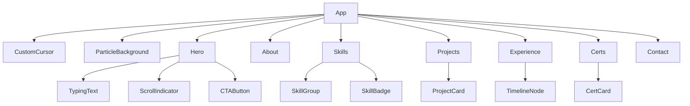

# Design Document: Kailash Chaudhary — Personal Portfolio

## Overview

A dark-cinematic, One Piece–atmospheric personal portfolio website for Kailash Chaudhary, a 2025 CS graduate and early-career Cloud/DevOps + Python engineer. The site uses a voyage/ocean/treasure-map aesthetic — not literal characters — to create a memorable, immersive browsing experience. Built on React + Vite + TypeScript with Tailwind CSS, GSAP ScrollTrigger, tsParticles, and react-tilt, it showcases seven sections (Hero → About → Skills → Projects → Experience → Certifications → Contact) with cinematic scroll storytelling, a custom gold cursor, and full mobile responsiveness with respect for `prefers-reduced-motion`.

The primary goals are: (1) make a strong first impression on engineering recruiters, (2) clearly communicate technical skills and project impact, and (3) provide a delightful, scroll-driven narrative experience that feels unique without being gimmicky.

---

## Architecture

### High-Level System Diagram



### Deployment Architecture



---

## Sequence Diagrams

### Initial Page Load & Animation Boot



### Scroll-Triggered Section Reveal



### Custom Cursor Interaction



---

## Components and Interfaces

### Component Tree



### Component: App

**Purpose**: Root shell. Mounts global overlays (cursor, particles), composes section order, injects ThemeProvider context.

**Interface**:
```typescript
// App.tsx
const App: React.FC = () => JSX.Element

// No props — root component
```

**Responsibilities**:
- Apply global CSS custom properties from theme config
- Mount `CustomCursor` and `ParticleBackground` as fixed-position overlays
- Render all seven sections in order
- Provide `ThemeContext` to the tree

---

### Component: CustomCursor

**Purpose**: Replaces native cursor with a gold dot + lagging outer ring. Ring expands on interactive elements.

**Interface**:
```typescript
interface CustomCursorProps {
  // No external props — self-contained, reads DOM via event listeners
}

const CustomCursor: React.FC<CustomCursorProps> = () => JSX.Element
```

**Responsibilities**:
- Listen to `window.mousemove` and update dot position immediately
- GSAP-lag the outer ring to create a trailing effect (`duration: 0.15`)
- Listen for `mouseenter`/`mouseleave` on `[data-cursor-expand]` elements to scale ring
- Render `null` on any device without a fine pointer — detected via `window.matchMedia('(pointer: fine)')`, not viewport width or user-agent sniffing. This correctly hides the custom cursor on touchscreens, tablets, and stylus-only devices regardless of screen size.
- Clean up all listeners on unmount

---

### Component: ParticleBackground

**Purpose**: Full-screen tsParticles canvas with slow-drifting gold motes over navy, pinned as a fixed background layer.

**Interface**:
```typescript
interface ParticleBackgroundProps {
  reducedMotion?: boolean
}

const ParticleBackground: React.FC<ParticleBackgroundProps> = (props) => JSX.Element
```

**Responsibilities**:
- Initialize tsParticles with gold mote config (see data models)
- When `reducedMotion` is true: render static gradient background only, skip particles
- z-index: 0, pointer-events: none so it never blocks interaction

---

### Component: Hero

**Purpose**: First-impression section — "Setting Sail". Contains headline, typing animation, tagline, CTAs, and scroll indicator.

**Interface**:
```typescript
interface HeroProps {
  // No external props
}

const Hero: React.FC<HeroProps> = () => JSX.Element
```

**Responsibilities**:
- Display "Kailash Chaudhary" as large Cinzel headline with GSAP stagger-letter reveal on mount
- Render `TypingText` cycling through role strings
- Show tagline and two CTA buttons (`View Projects`, `Get in Touch`) with `data-cursor-expand`
- Render `ScrollIndicator` (compass/log-pose needle SVG)
- Register GSAP ScrollTrigger to pin hero briefly and fade out on initial scroll

---

### Component: TypingText

**Purpose**: Animated text that types/deletes cycling through an array of role strings.

**Interface**:
```typescript
interface TypingTextProps {
  strings: string[]
  typeSpeed?: number   // ms per character, default 60
  deleteSpeed?: number // ms per character, default 35
  pauseMs?: number     // pause at full string, default 2200
  className?: string
}

const TypingText: React.FC<TypingTextProps> = (props) => JSX.Element
```

---

### Component: About

**Purpose**: "The Navigator" section with bio, education, and location details.

**Interface**:
```typescript
interface AboutProps {
  // No external props — content is static
}

const About: React.FC<AboutProps> = () => JSX.Element
```

**Responsibilities**:
- Display bio, education (PREC, SPPU, 2025, CGPA 7.90), location (Pune, open to Bengaluru)
- Wrap children in `SectionWrapper` for scroll-triggered reveal
- Optional decorative compass SVG motif in corner

---

### Component: Skills

**Purpose**: "The Arsenal" — categorized skill badges with staggered scroll reveal.

**Interface**:
```typescript
interface SkillGroup {
  category: string
  skills: string[]
}

interface SkillsProps {
  groups: SkillGroup[]
}

const Skills: React.FC<SkillsProps> = (props) => JSX.Element

interface SkillBadgeProps {
  label: string
  delay?: number
}

const SkillBadge: React.FC<SkillBadgeProps> = (props) => JSX.Element
```

---

### Component: Projects

**Purpose**: "The Treasure" — 3D tilt cards styled as weathered bounty posters.

**Interface**:
```typescript
interface Project {
  title: string
  stack: string[]
  impact: string
  githubUrl: string
  highlight?: string  // optional featured tag
}

interface ProjectCardProps {
  project: Project
  index: number       // for stagger delay calculation
}

const Projects: React.FC = () => JSX.Element
const ProjectCard: React.FC<ProjectCardProps> = (props) => JSX.Element
```

**Responsibilities**:
- Wrap each card in `react-tilt` (tiltMaxAngleX/Y: 10, glare: true, maxGlare: 0.15)
- Apply gold border glow + lift on hover via Tailwind `group-hover` + CSS transition
- Render stack tags as small badges
- GitHub link opens in new tab with `rel="noopener noreferrer"`

---

### Component: Experience

**Purpose**: "The Logbook" — vertical timeline of internship entries.

**Interface**:
```typescript
interface ExperienceEntry {
  role: string
  company: string
  period: string
  bullets: string[]
}

interface TimelineNodeProps {
  entry: ExperienceEntry
  index: number
  side: 'left' | 'right'
}

const Experience: React.FC = () => JSX.Element
const TimelineNode: React.FC<TimelineNodeProps> = (props) => JSX.Element
```

**Responsibilities**:
- Render vertical line styled as map route / ship's log
- Each node reveals on scroll (GSAP ScrollTrigger)
- Alternates left/right on desktop, stacks on mobile

---

### Component: Certs

**Purpose**: "The Marks" — certifications and publication display.

**Interface**:
```typescript
interface Certification {
  title: string
  issuer: string
  date: string
  type: 'certification' | 'publication'
  url?: string
}

interface CertCardProps {
  cert: Certification
}

const Certs: React.FC = () => JSX.Element
const CertCard: React.FC<CertCardProps> = (props) => JSX.Element
```

---

### Component: Contact

**Purpose**: "Send a Message in a Bottle" — social links and availability statement.

**Interface**:
```typescript
interface ContactLink {
  label: string
  href: string
  icon: React.ReactNode
}

const Contact: React.FC = () => JSX.Element
```

---

### Component: SectionWrapper

**Purpose**: HOC that applies consistent scroll-triggered reveal animation to any section.

**Interface**:
```typescript
interface SectionWrapperProps {
  id: string
  className?: string
  children: React.ReactNode
}

const SectionWrapper: React.FC<SectionWrapperProps> = (props) => JSX.Element
```

---

### Hook: useReducedMotion

**Purpose**: Reads `prefers-reduced-motion` media query and provides reactive boolean.

**Interface**:
```typescript
const useReducedMotion: () => boolean
// Returns true if user prefers reduced motion
```

---

### Hook: useScrollReveal

**Purpose**: Wraps GSAP ScrollTrigger reveal logic; respects reduced motion.

**Interface**:
```typescript
interface ScrollRevealOptions {
  yOffset?: number    // default 30
  duration?: number   // default 0.6
  stagger?: number    // default 0.1
  start?: string      // default "top 85%"
}

const useScrollReveal: (
  ref: React.RefObject<HTMLElement>,
  options?: ScrollRevealOptions
) => void
```

---

## Data Models

### Theme Configuration

```typescript
// src/theme/config.ts

export const theme = {
  colors: {
    base: {
      navy:       '#0A1428',
      navyLight:  '#0D1B2E',
    },
    accent: {
      ocean:      '#1B3A5B',
      oceanMid:   '#2C5F7C',
    },
    gold: {
      primary:    '#E8B23A',
      bright:     '#F2C94C',
    },
    text: {
      primary:    '#E8EDF2',
      secondary:  '#8FA3B8',
    },
  },
  fonts: {
    display: '"Cinzel", "Pirata One", serif',
    body:    '"Inter", "Satoshi", sans-serif',
  },
  motion: {
    durationFast:   0.3,
    durationNormal: 0.6,
    ease:           'power2.out',
  },
} as const

export type Theme = typeof theme
```

---

### Static Content Data

```typescript
// src/data/content.ts

export const HERO_ROLES: string[] = [
  'Cloud & DevOps Engineer',
  'Python Developer',
  'Backend Engineer',
  'AI/ML Builder',
]

export const SKILL_GROUPS: SkillGroup[] = [
  {
    category: 'CI/CD',
    skills: ['GitHub Actions', 'Jenkins', 'CodeDeploy'],
  },
  {
    category: 'Containers & Orchestration',
    skills: ['Docker', 'Kubernetes', 'Docker Compose'],
  },
  {
    category: 'AWS / Cloud',
    skills: ['EC2', 'S3', 'IAM', 'VPC', 'ALB', 'ASG', 'CloudWatch', 'WAF', 'Boto3'],
  },
  {
    category: 'IaC',
    skills: ['Terraform'],
  },
  {
    category: 'Observability',
    skills: ['CloudWatch', 'SNS'],
  },
  {
    category: 'Backend / APIs',
    skills: ['Python', 'FastAPI', 'Flask', 'REST APIs', 'SQLAlchemy', 'MySQL'],
  },
  {
    category: 'AI / ML',
    skills: ['LangChain', 'FAISS', 'HuggingFace', 'Groq', 'Llama 3.1', 'RAG', 'TensorFlow', 'Keras', 'OpenCV'],
  },
  {
    category: 'Scripting & Tools',
    skills: ['Python', 'Git', 'Bash'],
  },
]

export const PROJECTS: Project[] = [
  {
    title: 'LLM Document Q&A — RAG Pipeline',
    stack: ['FastAPI', 'LangChain', 'FAISS', 'HuggingFace', 'Groq/Llama 3.1', 'Kubernetes'],
    impact: 'Production-grade RAG pipeline serving semantic document search via LLM. Deployed on Kubernetes with CI/CD.',
    githubUrl: 'https://github.com/kailashji24/llm-document-qa-rag',
    highlight: 'Featured',
  },
  {
    title: 'AWS CI/CD Lift & Shift Pipeline',
    stack: ['Terraform', 'GitHub Actions', 'CodeDeploy', 'CloudWatch', 'SNS'],
    impact: 'Full IaC pipeline on AWS: Terraform-provisioned VPC/ALB/ASG, automated deployments via S3 + CodeDeploy, alerting via SNS.',
    githubUrl: 'https://github.com/kailashji24/test-repo-for-devops-app',
  },
  {
    title: 'Flask Student Registration System',
    stack: ['Flask', 'MySQL', 'SQLAlchemy', 'Docker Compose', 'Gunicorn', 'Jenkins'],
    impact: 'Full-stack registration app containerised with Docker Compose and shipped through a Jenkins CI/CD pipeline.',
    githubUrl: 'https://github.com/kailashji24/flask-student-registration-devops',
  },
  {
    title: 'Suspicious Activity Detection System',
    stack: ['LRCN (CNN+LSTM)', 'TensorFlow', 'Keras', 'OpenCV', 'Streamlit'],
    impact: 'Deep learning LRCN model for real-time CCTV threat detection. Published in IRJMETS, Feb 2025.',
    githubUrl: 'https://github.com/kailashji24/Suspicious-Activity-Detection',
    highlight: 'Published',
  },
]

export const EXPERIENCE: ExperienceEntry[] = [
  {
    role: 'Cloud & DevOps Intern',
    company: 'TechEazy Consulting',
    period: 'Oct 2025 – Dec 2025',
    bullets: [
      'Provisioned and managed cloud infrastructure on AWS',
      'Built and maintained CI/CD pipelines using GitHub Actions',
      'Worked with containerised workloads via Docker and Kubernetes',
    ],
  },
  {
    role: 'Cloud Associate Engineer Intern',
    company: 'TechnoGrowth Software Solutions',
    period: 'Dec 2023 – Jan 2024',
    bullets: [
      'Assisted in configuring AWS services (EC2, S3, IAM)',
      'Supported deployment automation and cloud monitoring setup',
    ],
  },
]

export const CERTIFICATIONS: Certification[] = [
  {
    title: 'AWS Solutions Architect Associate',
    issuer: 'Intellipaat',
    date: 'Mar 2025',
    type: 'certification',
  },
  {
    title: 'Advanced Cloud Computing & DevOps',
    issuer: 'IIT Roorkee iHUB',
    date: 'Jul 2025',
    type: 'certification',
  },
  {
    title: 'AWS Solutions Architecture Job Simulation',
    issuer: 'Forage',
    date: 'Jul 2025',
    type: 'certification',
  },
  {
    title: 'Suspicious Activity Detection Using LRCN',
    issuer: 'IRJMETS Vol.07 Issue 02',
    date: 'Feb 2025',
    type: 'publication',
  },
]
```

---

### Particle Configuration

```typescript
// src/config/particles.ts
import type { ISourceOptions } from '@tsparticles/engine'

export const particlesConfig: ISourceOptions = {
  fullScreen: { enable: false },
  background: { color: { value: 'transparent' } },
  particles: {
    number:    { value: 60, density: { enable: true } },
    color:     { value: '#E8B23A' },
    opacity:   { value: { min: 0.05, max: 0.25 } },
    size:      { value: { min: 1, max: 3 } },
    move: {
      enable:    true,
      speed:     0.4,
      direction: 'none',
      random:    true,
      outModes:  { default: 'out' },
    },
    links: { enable: false },
  },
  interactivity: {
    events: { onHover: { enable: false }, onClick: { enable: false } },
  },
  detectRetina: true,
}
```

---

## Key Functions with Formal Specifications

### Function: initScrollReveal()

```typescript
function initScrollReveal(
  elements: HTMLElement | HTMLElement[] | NodeListOf<Element>,
  options: ScrollRevealOptions,
  reducedMotion: boolean
): gsap.core.Tween
```

**Preconditions:**
- `elements` is non-null and at least one element exists in the DOM
- `options.duration` > 0 if provided
- `options.stagger` >= 0 if provided
- GSAP and ScrollTrigger are registered before this is called

**Postconditions:**
- Each element animates from `{ y: yOffset, opacity: 0 }` to `{ y: 0, opacity: 1 }` when it enters the viewport
- If `reducedMotion === true`, `y` offset is omitted; only opacity transitions
- Returns the GSAP tween so callers can kill it on unmount
- No mutation of element styles outside of the GSAP-managed properties

**Loop Invariants:** N/A (GSAP handles internal iteration)

---

### Function: TypingText animation loop

```typescript
async function runTypingLoop(
  strings: string[],
  setText: (s: string) => void,
  config: { typeSpeed: number; deleteSpeed: number; pauseMs: number },
  signal: AbortSignal
): Promise<void>
```

**Preconditions:**
- `strings.length` >= 1
- `typeSpeed` > 0, `deleteSpeed` > 0, `pauseMs` >= 0
- `signal` is an un-aborted `AbortSignal` at call time

**Postconditions:**
- Cycles through `strings` indefinitely, calling `setText` for each character step
- When `signal` is aborted, the loop terminates cleanly with no pending timers
- `setText` is never called after `signal` aborts

**Loop Invariants:**
- Current index `i` satisfies `0 <= i < strings.length` at every iteration start
- `currentText.length` is between 0 and `strings[i].length` inclusive during type/delete phases

---

### Function: buildCursorHandlers()

```typescript
function buildCursorHandlers(
  dotRef: React.RefObject<HTMLElement>,
  ringRef: React.RefObject<HTMLElement>
): {
  onMouseMove: (e: MouseEvent) => void
  onEnterExpand: () => void
  onLeaveExpand: () => void
  cleanup: () => void
}
```

**Preconditions:**
- `dotRef.current` and `ringRef.current` are mounted DOM elements
- GSAP is available

**Postconditions:**
- `onMouseMove`: sets dot position to `(e.clientX, e.clientY)` immediately; GSAP-tweens ring with `duration: 0.15`
- `onEnterExpand`: scales ring to 2.5×, reduces opacity to 0.6
- `onLeaveExpand`: scales ring to 1×, restores opacity to 1.0
- `cleanup`: removes all bound event listeners, kills all active tweens on refs

---

### Function: buildParticlesConfig()

```typescript
function buildParticlesConfig(reducedMotion: boolean): ISourceOptions
```

**Preconditions:**
- `reducedMotion` is a valid boolean

**Postconditions:**
- If `reducedMotion === false`: returns full config with 60 drifting particles
- If `reducedMotion === true`: returns config with `particles.number.value: 0` (no particles rendered)
- Returned config is a valid `ISourceOptions` object (never throws on load)

---

## Algorithmic Pseudocode

### Main Application Init Algorithm

```pascal
ALGORITHM initPortfolio()
INPUT: none
OUTPUT: mounted React application

BEGIN
  // Phase 1: Environment detection
  reducedMotion ← window.matchMedia("prefers-reduced-motion: reduce").matches
  hasFinePointer ← window.matchMedia("(pointer: fine)").matches
  // Using pointer capability check instead of viewport width or user-agent:
  // covers touchscreens, tablets, and stylus-only devices at any screen size.
  
  // Phase 2: Mount overlays
  IF hasFinePointer THEN
    mountCustomCursor(reducedMotion)
  END IF
  mountParticleBackground(reducedMotion)
  
  // Phase 3: Register GSAP plugins
  gsap.registerPlugin(ScrollTrigger)
  
  // Phase 4: Mount sections in order
  FOR EACH section IN [Hero, About, Skills, Projects, Experience, Certs, Contact] DO
    mountSection(section)
  END FOR
  
  // Phase 5: Hero-specific pin setup
  IF NOT reducedMotion THEN
    ScrollTrigger.create({
      trigger: "#hero",
      start:   "top top",
      end:     "+=300",
      pin:     true,
      scrub:   true
    })
  END IF
END
```

---

### Typing Animation Algorithm

```pascal
ALGORITHM runTypingLoop(strings, setText, config, signal)
INPUT:  strings   — array of role strings
        setText   — state setter callback
        config    — { typeSpeed, deleteSpeed, pauseMs }
        signal    — AbortSignal for cleanup
OUTPUT: infinite loop until aborted

BEGIN
  index ← 0
  
  WHILE signal IS NOT aborted DO
    current ← strings[index]
    
    // Type phase
    FOR i FROM 1 TO length(current) DO
      IF signal IS aborted THEN RETURN END IF
      setText(current[0..i])
      AWAIT sleep(config.typeSpeed)
    END FOR
    
    // Pause at full string
    AWAIT sleep(config.pauseMs)
    IF signal IS aborted THEN RETURN END IF
    
    // Delete phase
    FOR i FROM length(current) - 1 DOWNTO 0 DO
      IF signal IS aborted THEN RETURN END IF
      setText(current[0..i])
      AWAIT sleep(config.deleteSpeed)
    END FOR
    
    // Advance to next string (wrap around)
    index ← (index + 1) MOD length(strings)
  END WHILE
END

// Invariant: 0 ≤ index < strings.length at all times
// Invariant: during type phase, displayText is always a prefix of current
// Invariant: during delete phase, displayText length strictly decreases
```

---

### Scroll Reveal Algorithm

```pascal
ALGORITHM applyScrollReveal(ref, options, reducedMotion)
INPUT:  ref           — React ref to section container
        options       — { yOffset=30, duration=0.6, stagger=0.1, start="top 85%" }
        reducedMotion — boolean
OUTPUT: GSAP tween registered on ScrollTrigger

BEGIN
  IF ref.current IS NULL THEN
    RETURN  // Element not yet mounted; skip
  END IF
  
  targets ← ref.current.querySelectorAll("[data-reveal]")
  
  IF reducedMotion THEN
    fromVars ← { opacity: 0 }
  ELSE
    fromVars ← { opacity: 0, y: options.yOffset }
  END IF
  
  tween ← gsap.from(targets, {
    ...fromVars,
    duration:    options.duration,
    stagger:     options.stagger,
    ease:        "power2.out",
    scrollTrigger: {
      trigger: ref.current,
      start:   options.start,
      toggleActions: "play none none none"
    }
  })
  
  RETURN tween
  // Caller is responsible for calling tween.kill() on component unmount
END
```

---

## File Structure

```
portfolio-kailash/
├── public/
│   ├── favicon.ico
│   └── og-image.png
├── src/
│   ├── components/
│   │   ├── CustomCursor.tsx
│   │   ├── ParticleBackground.tsx
│   │   ├── Hero.tsx
│   │   ├── About.tsx
│   │   ├── Skills.tsx
│   │   ├── Projects.tsx
│   │   ├── Experience.tsx
│   │   ├── Certs.tsx
│   │   ├── Contact.tsx
│   │   ├── shared/
│   │   │   ├── SectionWrapper.tsx
│   │   │   ├── TypingText.tsx
│   │   │   ├── SkillBadge.tsx
│   │   │   ├── ProjectCard.tsx
│   │   │   ├── TimelineNode.tsx
│   │   │   ├── CertCard.tsx
│   │   │   ├── CTAButton.tsx
│   │   │   └── ScrollIndicator.tsx
│   │   └── decorative/
│   │       ├── CompassSVG.tsx
│   │       └── RopeKnotSVG.tsx
│   ├── hooks/
│   │   ├── useReducedMotion.ts
│   │   └── useScrollReveal.ts
│   ├── data/
│   │   └── content.ts
│   ├── theme/
│   │   └── config.ts
│   ├── config/
│   │   └── particles.ts
│   ├── styles/
│   │   ├── globals.css
│   │   └── cursor.css
│   ├── App.tsx
│   └── main.tsx
├── index.html
├── tailwind.config.ts
├── vite.config.ts
├── tsconfig.json
├── package.json
└── README.md
```

---

## Error Handling

### Scenario 1: tsParticles Init Failure

**Condition**: Network or browser error prevents tsParticles engine from loading.
**Response**: `ParticleBackground` wraps `Particles` in an error boundary. On failure, the component renders the plain navy gradient background.
**Recovery**: Site continues to function normally — particles are purely decorative.

---

### Scenario 2: GSAP ScrollTrigger Not Registered

**Condition**: GSAP/ScrollTrigger import fails or is used before registration.
**Response**: `useScrollReveal` catches the error and falls back to a simple CSS class toggle (`opacity: 1; transform: none`) instead of a GSAP tween.
**Recovery**: Sections appear without animation but all content is visible and accessible.

---

### Scenario 3: Fonts Fail to Load

**Condition**: Google Fonts CDN unreachable.
**Response**: CSS `font-family` stack falls back to system serif for display text and system sans-serif for body.
**Recovery**: Visual hierarchy is maintained; typography degrades gracefully.

---

### Scenario 4: External GitHub Links

**Condition**: GitHub repo URLs are invalid or repos are private.
**Response**: Links open in a new tab with `target="_blank" rel="noopener noreferrer"`. No in-page error.
**Recovery**: User sees a 404 on GitHub — no portfolio breakage.

---

## Testing Strategy

### Unit Testing Approach

Test each component in isolation using **Vitest + React Testing Library**.

Key test cases:
- `TypingText`: verify text cycles through all strings; verify cleanup on unmount stops the loop
- `useReducedMotion`: mock `matchMedia` to return both true and false; assert hook returns correct boolean
- `useScrollReveal`: mock GSAP; assert `gsap.from()` is called with correct `y: 0` when `reducedMotion = true`
- `buildParticlesConfig()`: assert particle count is 0 when `reducedMotion = true`
- `ProjectCard`: renders title, stack tags, impact text, and GitHub link correctly

### Property-Based Testing Approach

**Property Test Library**: fast-check (TypeScript-native)

Key properties:
- **TypingText loop invariant**: For any array of non-empty strings and any valid config, the displayed text is always a prefix of the current target string
- **Theme config exhaustiveness**: For every color key in `theme.colors`, the value matches a valid hex color pattern `/^#[0-9A-Fa-f]{6}$/`
- **Scroll reveal offset**: For any `yOffset` in `[0, 100]`, the GSAP `from.y` value never exceeds `yOffset` and is always 0 when `reducedMotion = true`

### Integration Testing Approach

- Render full `App` in a JSDOM environment; assert all seven section `id` attributes exist
- Verify `data-cursor-expand` attributes are present on all interactive elements (CTAs, project cards, links)
- Snapshot test for `particlesConfig` shape to prevent accidental regression

---

## Performance Considerations

- **Code splitting**: Each section component is lazy-loaded with `React.lazy` + `Suspense` so the initial bundle ships only Hero + global overlays
- **Particle count**: Capped at 60 particles; scales down to 30 on screens narrower than 768 px
- **GSAP batch**: Use `ScrollTrigger.batch()` for the Skills badges grid to reduce per-element trigger overhead
- **Font preloading**: `<link rel="preload">` for Cinzel woff2 in `index.html` to prevent FOUT on the hero headline
- **Image-free design**: All visual motifs are SVG or CSS — no raster assets to optimise
- **Vite build**: Tree-shaking removes unused GSAP modules; `manualChunks` splits vendor (GSAP, tsParticles) from app code

---

## Security Considerations

- **No backend**: Fully static — no server-side attack surface
- **External links**: All GitHub/LinkedIn/email links use `rel="noopener noreferrer"` to prevent tab-napping
- **Contact mailto**: Uses `mailto:` href — no form submission, no data handling, no CSRF surface
- **No `dangerouslySetInnerHTML`**: All dynamic content is plain strings from the static `content.ts` data file
- **CSP-friendly**: No `eval` usage; GSAP and tsParticles are bundled (not CDN-injected), making a strict Content-Security-Policy straightforward to add

---

## Dependencies

| Package | Version (pin) | Purpose |
|---|---|---|
| react | ^18.3.1 | UI framework |
| react-dom | ^18.3.1 | DOM renderer |
| typescript | ^5.5.3 | Type safety |
| vite | ^5.4.2 | Build tool + HMR |
| tailwindcss | ^3.4.10 | Utility CSS |
| gsap | ^3.12.5 | Scroll animations |
| @tsparticles/react | ^3.0.0 | Particle canvas |
| @tsparticles/slim | ^3.0.0 | Particle engine (slim bundle) |
| react-tilt | ^1.0.2 | 3D card tilt effect |
| @fontsource/cinzel | ^5.0.0 | Display font (self-hosted) |
| @fontsource/inter | ^5.0.0 | Body font (self-hosted) |

**Dev dependencies**:

| Package | Version | Purpose |
|---|---|---|
| vitest | ^2.0.5 | Test runner |
| @testing-library/react | ^16.0.0 | Component testing |
| fast-check | ^3.21.0 | Property-based testing |
| @types/react | ^18.3.5 | TypeScript types |
| autoprefixer | ^10.4.20 | CSS vendor prefixes |
| postcss | ^8.4.41 | CSS processing |

---

## Correctness Properties

1. **Reduced Motion Safety**: ∀ component C that uses animation, if `useReducedMotion() = true` then C renders without any `transform` or `y` offset animation — only opacity transitions are permitted.

2. **Cursor Accessibility**: ∀ interactive element E with `data-cursor-expand`, the native cursor is hidden (`cursor: none`) only when `CustomCursor` is mounted; otherwise the browser default cursor is always visible.

3. **Content Completeness**: ∀ project P in `PROJECTS`, P has a non-empty `title`, at least one `stack` entry, a non-empty `impact` string, and a valid HTTPS `githubUrl`.

4. **External Link Safety**: ∀ anchor element A that opens `target="_blank"`, A.rel includes both `"noopener"` and `"noreferrer"`.

5. **Typing Loop Termination on Abort**: ∀ call to `runTypingLoop`, when the controlling `AbortSignal` fires, the loop terminates within one `typeSpeed` or `deleteSpeed` tick — no timer callbacks fire after abort.

6. **Section ID Uniqueness**: ∀ sections S1, S2 in the rendered DOM, S1.id ≠ S2.id (required for anchor navigation and ScrollTrigger targeting).

7. **Particle Graceful Degradation**: ∀ browser environment B where tsParticles fails to initialise, the `ParticleBackground` component renders a non-empty fallback element with the base navy background color — the page is never blank.
